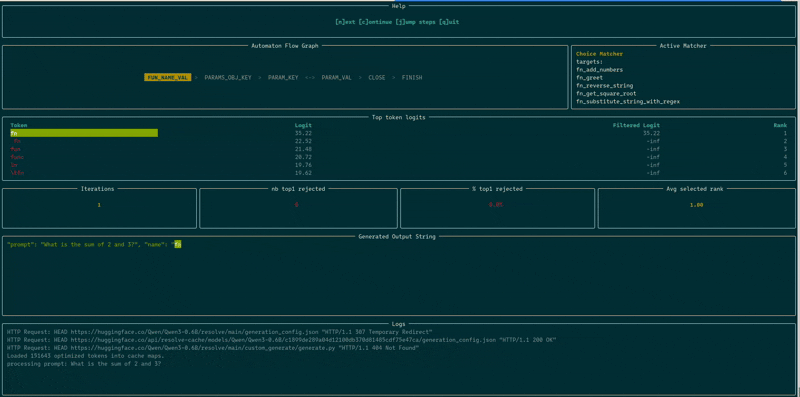
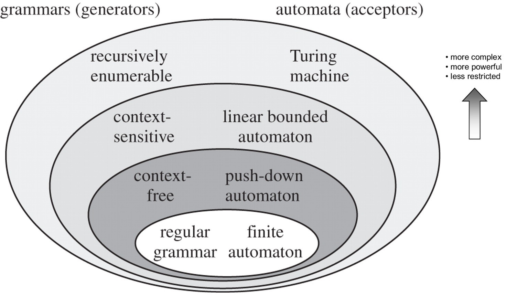
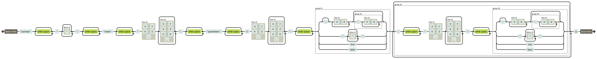

_This project has been created as part of the 42 curriculum by fpetit_

# Description

Small languages models (SLM) can achieve better performance under specific conditions. This project aims at implementing following optimizations : 

- __function calling__ to turn a natural language request into a function call
- __constrained decoding__ to ensure generated output follows required format (here JSON)

## Tools used in this project


# Progress

- [x] validate input and output
- [x] Pydantic schemas
- [x] extract vocabulary

- [x] constraints automata
- [x] generation loop by token and byte evaluation

- [x] tests
  - [x] accuracy > 95%
  - [x] performance < 5 mn for 10 provided inputs 
  - [x] robustness : extra tests + manual test for files permissions

- [x] debugging and observability
  - [x] DEBUG mode showing top-k best tokens and masking
  - [x] improved vizualisation : overall progress and stats


# Algorithm explanation

1. __GET__ _logits_ from model
2. __FOR EACH__ token in _logits_ :
   1.   DECODE token id to raw bytes
   2.   __IF__ token is invalid for current state (or potentially next state) SET its logit to _negative infinity_
   3.   __UPDATE__ _best token_
3. __RETURN__ _best token_ and CONSUME it
4. __UPDATE__ state
5.  __UPDATE__ generated text and update prompt


# Design decisions

## _Which global approach should be used to validate the output (constrained decoding) ?_

__regex pattern__ 

- __Pros__ : 
  - _performance_ : an eval through deterministic finite automaton occurs in linear complexity (O(n))
- __Cons__ : 
  - _flexibility_ : less adapted to nested structures (JSON, XML, code)

__context free grammar__

- ___Pros__ : 
  - _accuracy and performance_ : better suited than regex (and even state machine) for complex syntax, like nested structures.
- ___Cons__ : 
  - _complexity_ : depending on the chosen algorithm

__finite state machine__ (chosen option)

- __Pros__ : 
  - _performance_ : we can force part of the output when it is static
- __Cons__ : 
  - _maintenance_ : requires a big refactor when schemas change
  - _complexity_ : requires rigor when triggering state change (especially with dynamic transitions or tokens overlapping state boundaries)


## _How to delimit states boundaries ?_

Current state delimitation mirrors big chunks of expected JSON structure : OBJECT KEY, PARAM KEY, PARAM VALUE, ...

More specific states could have been added for careful management of transitions (ie COMMA). 
But the model was able to generate relevant tokens by itself most of the time, and we could simply dynamically update a state matcher instead of defining a new state (i.e. PARAM KEY matcher would expect a leading comma from the second parameter on)

## _Which global approach for detecting transitions ?_

Three kinds of matchers were defined and associated to each state : static (when only one target value is possible), choices (when multiple known in advance target values are possible) and value (when we check only that type coherence is maintained). Those matchers are stored in a stack (more precisely a list in python) and can be dynamically added (according to the numbers of params required by the function). Those matcher implement a common interface with `evaluate()`, `is_complete()`, `consume()` and `get_leftover()` methods, and manage the state buffer.

## _What should be granularity level of checks ?_

__byte level__ (first attempt)

- __Pros__ : _complexity_ : state change is easier to manage 
- __Cons__ : _performance_ : more iterations

__token level__ (chosen option)

- __Pros__ : _performance_ 
- __Cons__ : _complexity_ : cf. down overlapping token management

## _How to manage tokens overlapping state boundaries ?_

__reject tokens overlapping current and next state__

Ex : should we accept token `"a": 1` overlapping current state PARAM_KEY and next state PARAM_VAL

- __Pros__ : _complexity and maintenance_
- __Cons__ : _performance_, _fragility_ : risk of running short of tokens

__accept tokens overlapping state__

- __Pros__ : _performance_ : this is handled through greedy evaluation of next state (a lookahead on the next state for ValueMatcher) and storing leftover part as buffer for next state.
- __Cons__ : 


## _How to store the score of the next token ?_

__in place logit modification__

- __Pros__ : easy to write
- __Cons__ : harder to debug

__boolean mask__ (chosen option)

- __Pros__ : performance (with numpy)

# Known limitations

- no handling of null type
- when the prompt is empty or ambiguous, program does not provide a clear error message
- non-latin parameters are sometimes passed with their english translation
- no safeguards to prevent inacurrate parameters. For instance long numbers are not always reused as such in parameters. Ex : 9 x 10^18 reused as 9 x 10^19. Negative numbers are not reliably passed as arguments either.

# Performance analysis

| Criteria | Treshold | All vocabulary |
| --- | ---- | ----------------- |
| JSON validity | 100% | 100% |
| execution speed | < 300 s | 166 |
| accuracy | > 90% | 100% |


# Challenges faced

## Having a single source of truth for string comparisons
 
__Challenge__ : Detecting transitions in state machine relies on string comparison. However, BPE (byte pair encoding) tokenizers encoding does not always match UTF-8 (cf. supra). This can be a source of complexity in the code (when relating the token ID - which the state machine should exclusively operate on - with those two kinds of encoding : UTF-8 strings, BPE bytes), as well as latency (when converting on the fly).

__Mitigation__ : Building dictionaries once and for all. Tradeoff : _performance_ : some latency on initialization

## Code architecture and separation of concern

__Challenge__ : Patching for edge case can lead to adding layers of logic and spreading in matchers and/or at different states (evaluation - token consumption)

__Mitigation__ : 
- trying to have state redirection logic centralized in `AutomatonController` and having matchers implement a common interface.

## Minute evaluation of state transition

It is one of the key issues of the project (when relying on an automaton). Either validation is too laxist (leading to non valid json or inaccurate data), either it is too strict (leading to blocking state)

__Challenge examples__ : 
- When the generated token is `\\` it interferes with quote counting (necessary to validate that a proper string has been generated)
- The tokenizer can generate `"string"` : but it was not clear whether we should accept `"` in the ValueMatcher
- Some minor issues (such as generating two consecutive spaces after keys) were tolerable as it does not hinder json parsing

__Mitigation__ : 
- visual debugging
- first attempt by evaluating token at byte level. Tradeoff : Performance was below expected levels
- then token evaluation accepting overlapping states (cf. supra)
- then refactoring by rebuilding a state machine around a controller class and various kinds of Matcher (cf. supra)

## Balancing accuracy and speed

__Challenge__ : Adapting the granularity level on which to apply constraints (byte, character, token) proved difficult. Checking every character before consuming the token ensures accuracy, at the cost of performance. Moreover, it does not fully leverage on the possibilities of define state automaton.

__Mitigation__ : 
- comparison on byte sequences rather than character by character
- caching dictionaries
- forcing token ids on predictable sequences
- prefiltering tokens ahead of looping through them : did not improve much, as we need to remain permissive in most of the cases

## Grokking the theory

It took some time before distinguishing the big picture among all the new concepts introduced by the subject.
Little by little, the underlying concepts were explored.

# Testing strategy

## Improving debugging

`rich` library proved useful to build a table of logits (proposed and filtered) and a dashboard that can run in a step by step mode.



## Integration tests for provided inputs

Tests are run using `unittest`. A map of expected output was added in regard to each inputs prompt.

## Unit tests for key functions

To be done (`utils/convert`)

## Manual robustness tests

Partially done for missing files, file permissions. Could be converted to unit test.

# Possible extensions

- context-free grammars : BNF -> push-down automata would be the best take to improve code architecture and avoid patching limitations of finite state automaton
- multi-model compatibility
- recoding the tokenizer
- performance optimization with caching and or batching


# Resources

| Url | Kind | Note              |
| --- | ---- | ----------------- |
|[Andrew Docherty - Controlling your LLM](https://medium.com/@docherty/controlling-your-llm-deep-dive-into-constrained-generation-1e561c736a20)|🗞️ article|                   |
|[Aidan Cooper - A Guide to Structured Generation Using Constrained Decoding](https://www.aidancooper.co.uk/constrained-decoding/)|🗞️ article |3 forms (regex, code, hybrid) + pitfalls |
|[Willard & Louf- Efficient guided generation for LLM](https://arxiv.org/abs/2307.09702)|🗞️ article |2023 publication - not fully read|
|[On the topic of constrained decoding](https://www.emergentmind.com/topics/constrained-decoding-mechanism)|🗞️ articles digest | sota yet not fully digested|
|[Structured output from LLMs](https://www.youtube.com/watch?v=xpvFinvqRCA)|🎬 video | 17 mn. Good summary |
|[Argparse doc](https://docs.python.org/3/library/argparse.html) | 📔 doc | module to parse arguments |
|[Pydantic doc](https://pydantic.dev/docs/validation/latest/concepts/models/)|📔 doc|Models used to validate input|
|[Rich doc](https://rich.readthedocs.io/en/latest/index.html)|📔 doc|Styling console output|
|[Qwen 0.6B on HF](https://huggingface.co/Qwen/Qwen3-0.6B)| 📔 doc |                   |
|[Qwen 0.6B on APXML](https://apxml.com/models/qwen3-0-6b)| 📔 doc |                   |
|[BPE](https://en.wikipedia.org/wiki/Byte-pair_encoding)|📙 wikipedia article|                   |
|[Automata theory](https://en.wikipedia.org/wiki/Automata_theory)|📙 wikipedia article|                   |
|[Chomsky hierarchy](https://devopedia.org/chomsky-hierarchy)|📙 devopedia article| Good to know the association between grammars and automaya |

## Libraries usage

### argparse

- `ArgumentParser` holds the CLI configuration. Flags, types, default values are declared with `add_argument()`

### json module

- `load(filepath)` : transform a textfile with json into a python object (dict or list)
- `dumps(obj)` : convert tree into a string

### numpy

Optimize multidimensional array computation

- `np.argmax(array)` find index of maximum value. Used to select best candidate token
- `np.argsort(array)` : return indices that would sort array in asc. order. Used for debugging and visualization
- `np.full_like` generate a NumPy array with same shape and type as the one provided. Used to create a mask
- `np.isclose(a, b)` safely compare float arrays. Used for debugging and visualization
- `np.where(condition)`. Used for visualization (rank extraction)

### pydantic

Required by the subject. Ensure schema validation.

- `BaseModel` helps declare required fields and their types
- `Field` to add metadata or behavior (ex : default value)
- `TypeAdapter` can be used to validate pydantic model against python types with `validate_python(json)`

### rich

Enrich logs and debugging. rich methods can make use of markup to add [color](https://rich.readthedocs.io/en/stable/appendix/colors.html) and styling.

- `print` aliased as `rprint` is used in legacy debug functions
- `logging.RichHandler` can be integrated into python standard `logging` module. We get automatically colored lines, source filename and line number
- dashboard is generated using following elements: 
  - `live.Live` manages smooth real-time update
  - `console.Console` provides info about terminal (and includes unused helper methods like automatic json formatting)
  - `layout.Layout` splits terminal into a flexible grid
  - `panel.Panel` wraps content into a framed border with title
  - `table.Table` and `text.Text` structure tabular data and text blocks
  - `align.Align` centers content within layout cells

Promising features : `rich.traceback` to get structured traceback messages integrating source code

## AI Usage

- __concept exploration__ and __documentation__(_define following concepts, disambiguate their relationships, provide an ontology or knowledge graph relative to following themes_)
- __guidance__ (_without giving code, define steps to reach this goal_) used to : 
  - learn how to setup a python project with new tools (uv)
  - learn rich syntax
- __code generation__ for repetitive tasks, as well as to provide a first example of a working setup when none was discovered (ie : state checking in a state machine)
- __feedback on code__ on generated code (_evaluate code quality and assess performance, security. If it does not meet requirements, prioritize tasks for its refactoring_)
- __debugging__ (_what is the cause of such error ? how to debug ? is it A, B or another ?_)

# Example usage

Prerequisites (from project page): 
- installation of SDK
- functions definitions and prompts in json format

```bash
# installing dependencies
make install

# running program
make run

# running program step by step with debugging dashboard
make run-steps

# running tests
make test

# format linting and static analysis
make lint

# fixing format
make format
```

# Concepts and Glossary

| Term | Def | Note              |
| --- | ---- | ----------------- |
|logit|raw score for a probable next token|usually spanning from -20 to +20|
|vocabulary|complete sets of unique tokens that a LM is trained to recognize and generate|Each token is mapped to a token ID|
|tensor|multidimensional container for numerical data. Can represent scalars (0 dimension), vectors (1D) and matrices (2D) to higher dimensions (N-D).|In a model, they store weights, input and other layers such as logits during inference|
|BPE (Byte pair encoding) tokenizer|Subword tokenization algorithm that merges most frequent pairs of adjacent characters or bytes into new tokens until a |Byte-level BPE initiates the process from 256 possible raw bytes values to ensure that any arbitrary binary flow can be tokenized without generating an unknown token error|
|ChatML|markup language developed by OpenAI and used in other models (Qwen) to structure a conversation|`<|im_start|>` indicates a new message and followed by sender role (`system`, `user`, `assistant`)|
|automaton|computing model following a sequence of operations|we are using a specific kind of automaton here : Finite State Automaton (FSA)|
|Trie or prefix tree|a search tree data structure storing an associative array where keys are equences|A trie allows to identify which token ID matches a valid string prefix allowed by the state machine.|
|Interleaved generation|pattern where the generation loop switches between model-generated and forced text||
|Prompt control|Manipulating prompt context, logit distribution of sampling loop parameters during generation||


## Grammars and State machines



Chomsky hierarchy distinguished in 1956 4 levels of language, according to the restriction of their grammar. Each one can be parsed by a kind of state machine or automaton (cf. picture). 

- _regular grammar_ is the most restrictive. It can be parsed by a __deterministic finite state automaton (DFA)__ relying on linear transitions to validate predictable patterns. 
- context-free grammar enable more abstraction. It can be parsed by a __push-down automaton (PDA)__ based on a stack. Transition is guided not only by current symbol, but also by the one at the top of the heap. It can handle infinite nested structures.
- context-sensitive grammar : closest to programming and natural languages
- recursively enumerable grammar

Let's focus on the first two. Why ? Because on one side JSON is a context-free grammar (requiring a stack for potentially nested objects : here function params), but on the other, as we know the skeleton of expected output, and once we managed dynamically nested objects, we can rely on elements of a finite automaton (forced output, matchers).


### CFG - Context free grammar

CFG describe a syntaxis using relation between symbols. Some symbols are _terminal_ and represent the basic units (eg. digit or even bytes). Some are _non-terminal_ and are built upon them (eg float consisting possibly of a sequence of digits, dot, digits). cf. CFG in [JSON RFC 4627](https://www.rfc-editor.org/info/rfc4627/#section-2.2).

Most notable types of CFG families are
- LL : which we can read from left to right, with leftmost derivation (the leftmost non terminal symbol is replaced first)
- LR : which we can read from left to right, with inversed rightmost derivation. They are also called "bottom-up" as they start from terminal symbols.

A simplified example of grammar for the project would be:

```txt
output            = begin_object
                    json_prompt value_separator
                    json_name value_separator
                    json_parameters
                    end_object

json_prompt       = '"prompt" name_separator string
json_name         = '"name"' name_separator string
json_parameters   = '"parameters"' name_separator parameter_object
parameter_object  = begin_object [ member { value_separator member } ] end_object
member            = string name_separator value
value             = json_number | json_string | json_boolean
json_number       = [ "-" ] digit { digit } [ "." digit { digit } ] 
json_string       = '"' { char } '"' 
json_boolean      = "true" | "false" 

begin_object     = "{"
end_object       = "}"
name_separator   = ":"
value_separator  = ","
string           = '"' { char } '"'
char             = upperchar | lowerchar | digit | "_"
upperchar        = "A" | "B" | "C" | "D" | "E" | "F" | "G" | "H" | "I" | "J" | "K" | "L" | "M" | "N" | "O" | "P" | "Q" | "R" | "S" | "T" | "U" | "V" | "W" | "X" | "Y" | "Z"
lowerchar        = "a" | "b" | "c" | "d" | "e" | "f" | "g" | "h" | "i" | "j" | "k" | "l" | "m" | "n" | "o" | "p" | "q" | "r" | "s" | "t" | "u" | "v" | "w" | "x" | "y" | "z"
digit            = "0" | "1" | "2" | "3" | "4" | "5" | "6" | "7" | "8" | "9"

```

Extended Backus-Naur form
```
=  : strictly
[] : optional
{} : 0 or more
A|B|C : altermatives
```


_railroad diagram_ representing this CFG

__derivation__ refers to the replacement pattern of non-terminal symbols when constructing a valid sentence.

## Byte-pair encoding tokenization

Encode _most frequent pairs of adjacent bytes_ into a new token, until the _vocabulary_ reaches a certain size.

While classical BPE starts from a character, _byte-level BPE_ (first used by GPT-2, then other models such as Qwen) builds upon raw bytes (ranging from 0 to 255). BPE allows to tokenize any binary flow (code, pictures, ...) without labelling any token as unknown.

__Tokenization example__

Starting from `"Hi 😄!"`

- Text to bytes
Each character becomes a byte (or series of bytes):
  - `H` -> `\x48`
  - `i` -> `\x69`
  - ` ` -> `\x20`
  - `😄`-> `\xf0\x9f\x98\x84`
  - `!` -> `\x21`

- Bytes to printable Unicode
To prevent control characters and space from breaking regexes or internal processes, we have to ensure that every possible byte value (0 to 255) is interpretable as a printable character.
  - `\x20` (32 in decimal value) -> `\x120` (Ġ, 288 in decimal value)

cf. function `bytes_to_unicode` in the project : it simply adds 256 to non printable characters.

- Grouping
Pairs are iteratively merged (most frequent are merged first), till the vocabulary reaches its max size (151 643 tokens for Qwen-2)
  - `\x48` (H) + `\x69` (i) -> token ID (ex 1234)

# Appendix

## Qwen 0.6B model identity

- 500 Mns parameters
- vocabulary size of 151,936

## Current usage of constrained decoding

_most of those tools were not authorized by the subject. Therefore it is just an overview for the sake of knowing current usage in the professional sphere_

### High-level : frameworks and model providers API
- Many models providers API such as OpenAI accept Pydantic models argument to constrain output
- [Guidance](https://github.com/guidance-ai/guidance) : Python library by Microsoft
- [Outlines](https://github.com/dottxt-ai/outlines) : Python library for structured output : converts JSON schema, Pydantic models, Regex into DFA or PDA

### Low-level : Inference engines

- [llama.cpp](https://llama-cpp.com/) : supports CFG decoding via GBNF
- [SGLang](https://github.com/sgl-project/sglang) : supports regex contraints, control primitives (`select`, `gen` 
- [vLLM](https://vllm.ai/) : integrates structured decoding through third party libs(Outline, Guidance) in continuous batching engine. cf [doc](https://vllm.ai/blog/2025-01-14-struct-decode-intro)

### Complementary approach

- [DSPy](https://dspy.ai/) : optimizes prompts and examples to get closer to expected output
